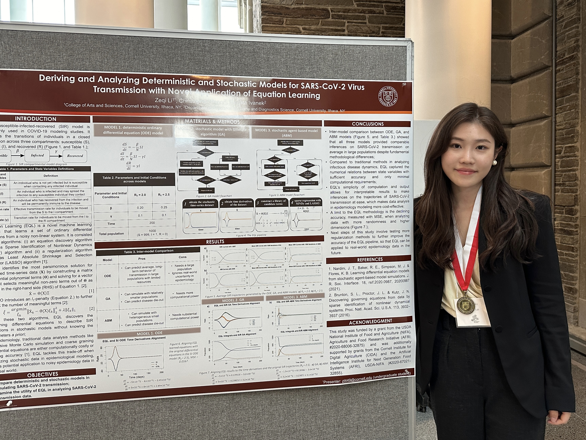
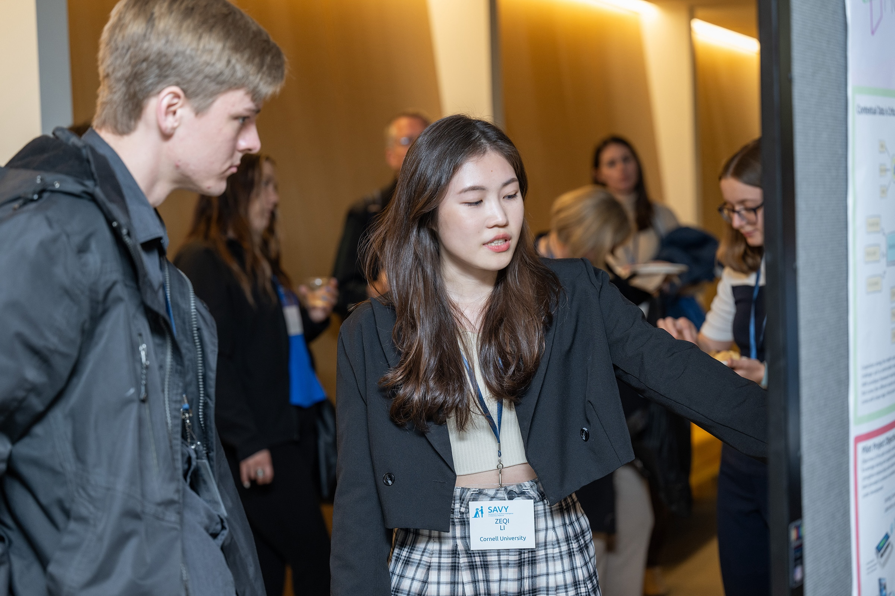

In my [CV](https://drive.google.com/file/d/1QZfZNDvxepmg03yiR5A8GKHDhK_ue7Kb/view?usp=drive_link), you may find out more about my endeavors and skills.

Here are some projects I'm currently working on in my P8105 Data Science I class at Columbia:

* [Analyzing housing and rental prices data on Zillow](https://github.com/joielizeqi/P8105_mtp_zl3545)

* [Wrangling with Fetal Alcohol Syndrome data](https://github.com/joielizeqi/P8105_data_wrangling_i)

{width=45%} {width=50%}