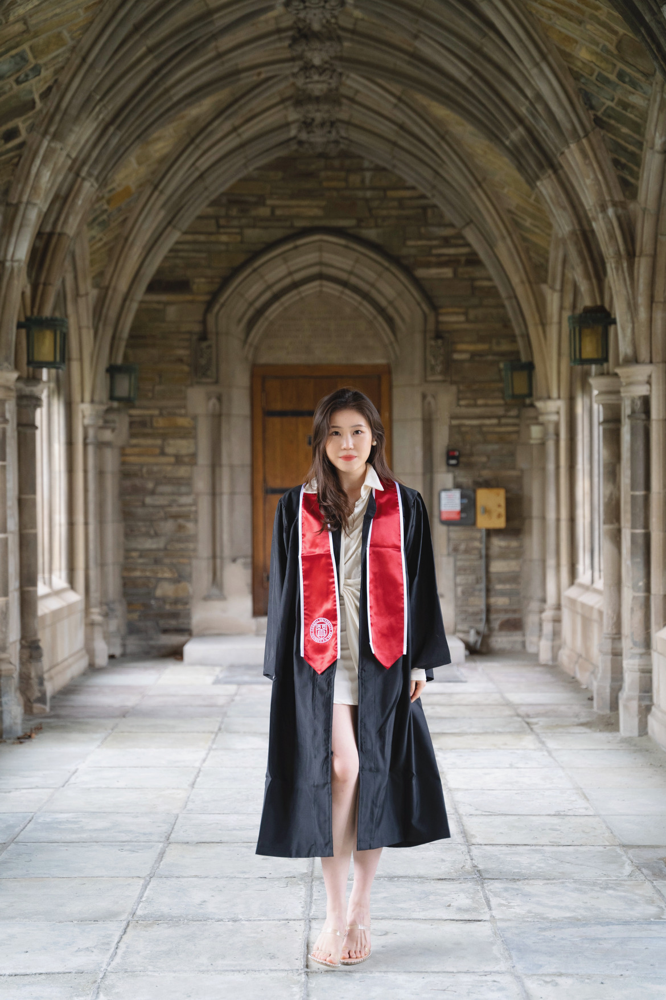

<center>
# Welcome to my website!
</center>

<table>
  <tr>
    <td style="vertical-align: top">
      <p>**Hi, this is Zeqi (Joie) Li :)**</p>
      <p>I'm currently a first-year graduate student at Columbia University Irving Medical Center, pursuing an M.S. degree in Biostatistics. My research interests include precision medicine, computer-aided drug discovery, and AI-driven clinical support systems.</p>
      <p>Before that, I graduated from Cornell University with a B.A. degree in Biological Sciences in May 2024. I researched on deterministic and stochastic epidemiological modeling and symbolic regression under Dr. Renata Ivanek. You may learn more about my previous experience and projects via my CV on the [about](about.html) page.</p>
      <p>On this website, you will find my passions, both academic and personal, and my journey in biostatistics. Please feel free to reach out with questions, and thank you for visiting my portfolio!</p>
    </td>
    <td style="vertical-align: top">
```{r, echo = FALSE, out.width = "100%", fig.align="right"}

```
    </td>
  <tr>
</table>
